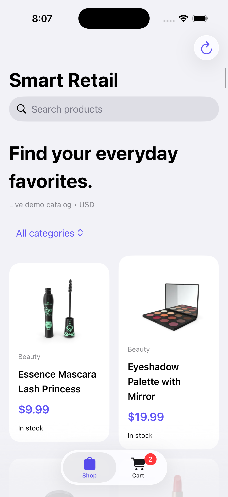
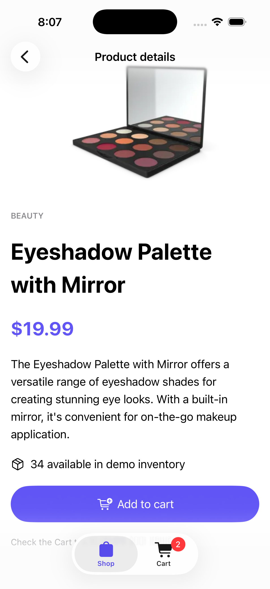
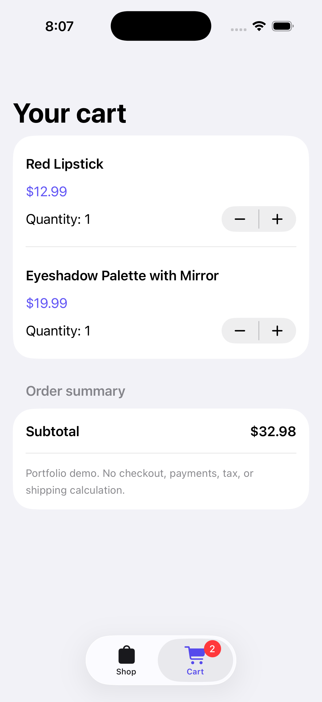

# Smart Retail — iOS Shopping App

A SwiftUI portfolio application for browsing a fictional product catalog, exploring product details, and managing a persistent shopping cart.

**Stack:** Swift · SwiftUI · MVVM · URLSession · REST · Core Data · XCTest  
**Target:** iOS 16+ · Xcode 15+ · No third-party dependencies

## Run locally

1. On a Mac with Xcode and an iOS Simulator runtime installed, open `SmartRetail.xcodeproj`.
2. Select the **SmartRetail** scheme and an **iPhone simulator**.
3. Press **⌘R**. An internet connection loads the live DummyJSON catalog.
4. If the API cannot be reached, the app shows a saved catalog or clearly labeled bundled samples.

Simulator builds do not need a paid Apple Developer membership. For a physical device, choose your signing team and a unique bundle identifier under Signing & Capabilities.

## Features

- Adaptive product grid, search, category filters, and product details.
- REST integration for product names, descriptions, prices, stock, and images.
- Pull-to-refresh and toolbar refresh, with loading and offline status.
- Core Data persistence of catalog metadata and cart contents.
- Cart quantity changes, removal, stock limits, and Decimal-based subtotals.
- Cart reconciliation when refreshed prices or availability change.
- Native navigation, Dynamic Type, semantic colors, accessibility labels, and light/dark appearance.
- XCTest cases and a macOS GitHub Actions build/test workflow.

## Architecture

```text
Sources/
  SmartRetailApp.swift    App entry point and shared view model
  Product.swift           Codable domain models and catalog filtering
  ProductAPI.swift        URLSession API client and injectable protocol
  CatalogStore.swift      Core Data persistence
  ShopViewModel.swift     Catalog, cart, loading, and persistence state
  ShopViews.swift         Catalog, product detail, and cart screens
Tests/
  RetailTests.swift       Filtering, money, cache, cart, and offline tests
```

SwiftUI views observe the main-actor view model. The view model requests data through `ProductServing` and stores local state through `CatalogStore`. The service protocol enables network-free tests. Cart saves are serialized to prevent older snapshots overwriting newer quantities.

Core Data uses a programmatic `Snapshot` entity (`key`, `payload`) with two versioned JSON records: `catalog.v1` and `cart.v1`. This is intentionally a compact snapshot cache, not a normalized product database. For a larger catalog, introduce product/cart entities, background imports, database predicates, migrations, and paginated loading.

## API and offline behavior

The app requests all demo products in one call:

```http
GET https://dummyjson.com/products?limit=0&select=id,title,description,category,price,stock,thumbnail
```

Search and category filtering happen locally. Prices are displayed in USD for this demonstration. Metadata and the cart persist across launches. Product images use `AsyncImage`; persistent offline image caching is not implemented, so images may show a placeholder offline. Cached stock and prices may be stale. A real purchase would require server-side price/stock validation.

## Test

Use **Product → Test** or **⌘U** in Xcode. Tests cover:

- Combined case-insensitive search and category filtering.
- Exact Decimal arithmetic for cart totals.
- Core Data snapshot round-trip and replacement.
- Out-of-stock products, stock caps, and removal.
- Cached catalog fallback after a network failure.

Manual walkthrough:

1. Browse online, search for a product, select a category, and open details.
2. Add an item, change its quantity, remove it, and check the total.
3. Add an item again, terminate the app, and reopen to confirm persistence.
4. Turn off the Mac's network connection and reopen; confirm cached metadata and cart are accessible. The simulator normally uses the Mac's network connection.
5. Try Dynamic Type, dark mode, VoiceOver, and landscape orientation.

## GitHub

Create an empty repository named `smart-retail-ios`, open Terminal in this project folder, and run:

```bash
git init -b main
git add .
git commit -m "Add SwiftUI retail portfolio app"
git remote add origin https://github.com/YOUR_USERNAME/smart-retail-ios.git
git push -u origin main
```

Replace `YOUR_USERNAME` with your GitHub username. Authenticate using GitHub's supported sign-in flow when prompted. The included `.github/workflows/ios.yml` builds and runs tests on an available iPhone simulator.

Suggested repository description: **SwiftUI shopping app with REST product browsing, local search, category filters, Core Data offline caching, and a persistent cart.**

Suggested topics: `swift` `swiftui` `ios` `mvvm` `core-data` `rest-api` `xctest`.

## Portfolio presentation

After running the app, capture your own simulator screenshots of the catalog, product details, and cart. Add them to a `screenshots/` directory and link them here. Record a short demonstration of offline access. Do not present placeholder or generated screenshots as verified app output.

Suggested next improvements: paginated API browsing, favorites, sorting, image caching, UI automation, and a real checkout sandbox.

## Scope and validation

This is a portfolio prototype with fictional inventory; it does not process orders or payments. No claim of a completed accessibility audit or App Store readiness is made.

The generated project structure and configuration were checked in a Linux environment. **The iOS app and XCTest suite have not been compiled or run here because Xcode and Apple SDKs are unavailable. Run ⌘R and ⌘U on your Mac before treating the project as verified or adding performance claims.**

Reference: [DummyJSON Products API](https://dummyjson.com/docs/products).


## Screenshots

| Browse products | Product details | Shopping cart |
|---|---|---|
|  |  |  |